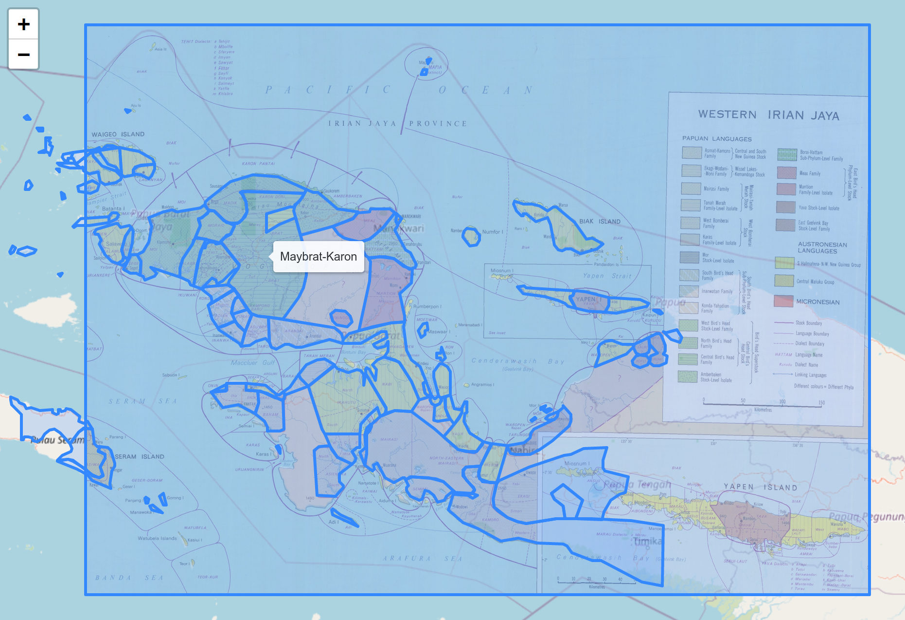

## Source

This dataset is derived from ECAI's Pacific Language Mapping project, described as follows:

> Languages included in this Atlas cover about one third of the world's 6,000 languages. The regions of the Pacific, Southeast Asia (apart from Burma), and Madagascar are documented. By the end of this century most of these languages will be extinct, thus limiting our ability to comprehend the diversity of human experience.

> The importance of ECAI mapping these languages and cultures, whether on a single island or across the vastness of Oceania, is to geographically view layers of data through time. This process allows for geo-referenced data to be accessible with the ability to electronically connect, display, share, and analyze materials.

> ECAI Pacific Language Mapping is a result of the ECAI Austronesia Team that was initiated by Prof. Lewis Lancaster, founder and director of ECAI, at the Conference on Austronesian Studies in Taiwan--Retrospect and Prospect, held at UC Berkeley in 1997. The ECAI Austronesia Team started from this conference on linguistics, history, anthropology, and archaeology as a digital mapping project. Digital language mapping continued in Taiwan by Paul Li resulting in his publications 2000 and 2001. Projects continued to gradually include Southeast Asia with projects of GIS in Hainan, China, by Christian Anderson (2003) and a demonstration of geographic search for Cebuano language sources in the central Philippines by Michael Buckland (2002).

> The ECAI Austronesia Team obtained copyright permission from the Australian Academy of the Humanities to create and distribute digital versions of their materials contained in the Language Atlas of the Pacific Area (Wurm, S. A., and S. Hattori, 1981 and 1983, Canberra: Australian Academy of the Humanities in collaboration with the Japan Academy).

> The ECAI Digital Pacific Language Map spans the extent of Pacific languages including Austronesian languages, Papuan languages, Australian aboriginal languages, and the Austro-Asiatic languages of Southeast Asia. Others such as trade, pidgin, and continental languages are represented as related to Pacific language regions.


## Processing

The data published in ECAI's shapefile was preprocessed as follows:

- Minimal fixes of the actual GIS data have been necessary, e.g. making sure polygons do not self-intersect, etc.
- Obvious errors or inconsistencies of the metadata have been corrected, e.g. normalizing the field names.

The cleaned up metadata was then used to map languages as specified in the ECAI data to Glottolog languoids,
see [etc/languages.csv](etc/languages.csv).

These mappings were then used to create aggregations of the shapes on two levels:

1. Speaker areas - as given in the shapefile - were combined on language level. I.e. all shapes mapped to
   the same Glottolog language were merged into a single GeoJSON `MultiPolygon`.
2. The same aggregation algorithm was used to create speaker areas on top-level family level.

**Notes:**
- Areas labeled as "uninhabited", or in other ways that did not provide any basis for identifying a corresponding
  language, were ignored.
- Areas labeled as language (sub-)groups with no counterpart in Glottolog's classification (e.g. "Papuan") were
  ignored.
- Languoids in this dataset are related to the original shapes through a list-valued foreign key, i.e. a many-to-many relation. Thus,
  examining languoids together with the source shapes requires joining tables which can easily be done via
  [CLDF SQL](https://github.com/cldf/cldf/blob/master/extensions/sql.md).
  As expected, the big language families of the area have the biggest number of associated shapes:
  ```sql
  SELECT l.cldf_name, count(c.cldf_id) AS c
  FROM LanguageTable AS l 
  JOIN LanguageTable_ContributionTable AS cassoc ON cassoc.LanguageTable_cldf_id = l.cldf_id
  JOIN ContributionTable AS c ON c.cldf_id = cassoc.ContributionTable_cldf_id
  GROUP BY l.cldf_id
  ORDER BY c DESC LIMIT 4;
  ```
  family | shapes
  --- | ---:
  Austronesian|1259
  Nuclear Trans New Guinea|389
  Austroasiatic|107
  Pama-Nyungan|104
