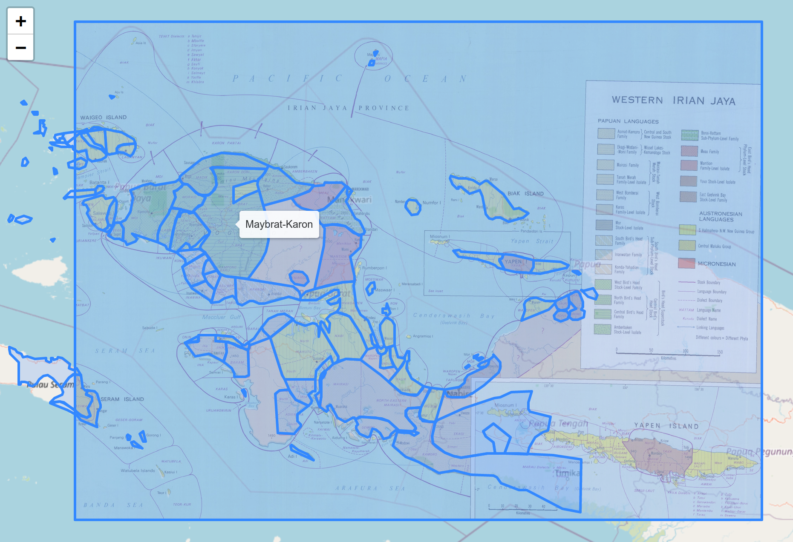
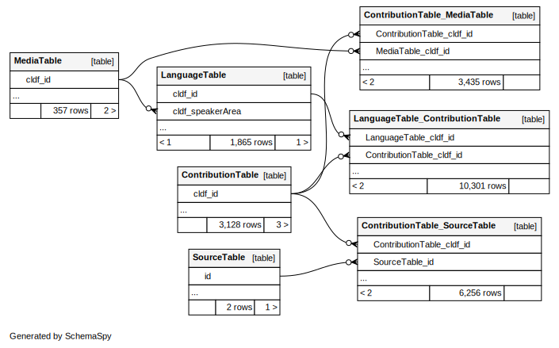

# CLDF dataset derived from the ECAI digitization of Wurm and Hattori's "Language Atlas of the Pacific Area" from 1981 and 1983

[](https://github.com/cldf-datasets/languageatlasofthepacificarea/actions?query=workflow%3ACLDF-validation)

## How to cite

If you use these data please cite
- the original source
  > Wurm, S. & Hattori, S. Language Atlas of the Pacific Area: New Guinea area, Oceania, Australia, vol. 66 of Pacific Linguistics: Series C (Canberra: Research School of Pacific and Asian Studies, Australian National University, Canberra, 1981).
  > Wurm, S. & Hattori, S. Language Atlas of the Pacific Area: Japan area, Taiwan-Formosa, Philippines, Mainland and insular South-East Asia, vol. 67 of Pacific Linguistics: Series C (Canberra: Research School of Pacific and Asian Studies, Australian National University, Canberra, 1983).
  > Registered scans and GIS dataset released by the Electronic Cultural Atlas Initiative (ECAI).
- the derived dataset using the DOI of the [particular released version](../../releases/) you were using

## Description


Wurm & Hattori’s Language Atlas of the Pacific Area describes the geographic speaker areas of the languages and language varieties spoken in the Pacific. Thanks to the efforts of the Electronic Cultural Atlas Initiative, this monumental piece of work has been available in digital form for over 15 years. But lacking proper identification of language varieties this digitized data was largely unusable for today’s research methods. This CLDF dataset turns ECAI’s digitized artefacts of the Language Atlas into an open, reusable geo-referenced dataset of speaker area polygons for a quarter of the world’s languages.

This dataset is licensed under a CC-BY-NC-4.0 license




## Source

This dataset is derived from [data released by ECAI's Pacific Language Mapping project](https://ecaidata.org/organization/ecai-pacific-language-mapping), described as follows:

> Languages included in this Atlas cover about one third of the world's 6,000 languages. The regions of the Pacific, Southeast Asia (apart from Burma), and Madagascar are documented. By the end of this century most of these languages will be extinct, thus limiting our ability to comprehend the diversity of human experience.

> The importance of ECAI mapping these languages and cultures, whether on a single island or across the vastness of Oceania, is to geographically view layers of data through time. This process allows for geo-referenced data to be accessible with the ability to electronically connect, display, share, and analyze materials.

> ECAI Pacific Language Mapping is a result of the ECAI Austronesia Team that was initiated by Prof. Lewis Lancaster, founder and director of ECAI, at the Conference on Austronesian Studies in Taiwan--Retrospect and Prospect, held at UC Berkeley in 1997. The ECAI Austronesia Team started from this conference on linguistics, history, anthropology, and archaeology as a digital mapping project. Digital language mapping continued in Taiwan by Paul Li resulting in his publications 2000 and 2001. Projects continued to gradually include Southeast Asia with projects of GIS in Hainan, China, by Christian Anderson (2003) and a demonstration of geographic search for Cebuano language sources in the central Philippines by Michael Buckland (2002).

> The ECAI Austronesia Team obtained copyright permission from the Australian Academy of the Humanities to create and distribute digital versions of their materials contained in the Language Atlas of the Pacific Area (Wurm, S. A., and S. Hattori, 1981 and 1983, Canberra: Australian Academy of the Humanities in collaboration with the Japan Academy).

> The ECAI Digital Pacific Language Map spans the extent of Pacific languages including Austronesian languages, Papuan languages, Australian aboriginal languages, and the Austro-Asiatic languages of Southeast Asia. Others such as trade, pidgin, and continental languages are represented as related to Pacific language regions.


### Copyright and license

The scanned atlas leaves and the Geo-Registered GIS dataset are made available under a CC-BY license (CC-BY-NC for the leaves of Taiwan).

> Registered scans of the maps from the Language Atlas of the Pacific Area (excluding the maps of Japan) are made available through the Electronic Cultural Atlas Initiative (ECAI) Metadata Clearinghouse as a result of cooperation between Academia Sinica and the ECAI Austronesian Atlas Team led by David Blundell and Lawrence Crissman. The Australian Academy of the Humanities, which owns the copyright to the available maps, has graciously permitted their reproduction and distribution in this digital format, and we are grateful for their support. Any public use of the maps should acknowledge their source and copyright ownership.

Thus, this derived dataset is licensed in its entirety under a CC-BY-NC license.


## Processing

### Shapefile

The data published in ECAI's shapefile was preprocessed as follows:

- Minimal fixes of the actual GIS data have been necessary, e.g. making sure polygons do not self-intersect, etc.
- Obvious errors or inconsistencies of the metadata have been corrected, e.g. normalizing the field names.

The cleaned up metadata was then used to map languages as specified in the ECAI data to Glottolog languoids,
see [etc/languages_with_comment.csv](etc/languages_with_comment.csv).

These mappings were then used to create aggregations of the shapes on two levels:

1. Speaker areas - as given in the shapefile - were combined on language level. I.e. all shapes mapped to
   the same Glottolog language were merged into a single GeoJSON `MultiPolygon`.
2. The same aggregation algorithm was used to create speaker areas on top-level family level.

**Notes:**
- Areas labeled as "uninhabited", or in other ways that did not provide any basis for identifying a corresponding
  language, were ignored.
- Areas labeled as language (sub-)groups with no counterpart in Glottolog's classification (e.g. "Papuan") were
  ignored.


### Scanned Atlas leaves

While the Atlas leaves for New Guinea were [available in geo-referenced form from ECAI](https://ecaidata.org/dataset/language_atlas_of_the_pacific_scanned_atlas_leaves_-_new_guinea)
we opted to recreate new geo-referenced versions of all Atlas leaves (except for the maps of Japan which were excluded from release).
We did this to
- provide geo-referenced images for all available maps
- in GeoTIFF format (rather than the ESRI World File variant of geo-referencing provided for the New Guinea maps).

This allowed us to also create "better" geo-referenced images in the sense that more control points could be used
thereby allowing for more complex transformations which increased the overall fit of the geo-referencing.
We could also derive images reprojected to EPSG:3857 ([Web Mercator projection](https://en.wikipedia.org/wiki/Web_Mercator_projection))
suitable for overlaying on web maps (which created a good setup for quality control of the language matches).


## Usage

Languoids in this dataset are related to the original shapes through a list-valued foreign key, i.e. a many-to-many relation. Thus,
examining languoids together with the source shapes requires joining tables which can easily be done via
[CLDF SQL](https://github.com/cldf/cldf/blob/master/extensions/sql.md).
As expected, the big language families of the area have the biggest number of associated shapes:
```sql
SELECT l.cldf_name, count(c.cldf_id) AS c
FROM LanguageTable AS l 
JOIN LanguageTable_ContributionTable AS cassoc ON cassoc.LanguageTable_cldf_id = l.cldf_id
JOIN ContributionTable AS c ON c.cldf_id = cassoc.ContributionTable_cldf_id
GROUP BY l.cldf_id
ORDER BY c DESC LIMIT 4;
```
family | shapes
--- | ---:
Austronesian|1259
Nuclear Trans New Guinea|389
Austroasiatic|107
Pama-Nyungan|104

[Speaker area shapes](https://github.com/cldf/cldf/tree/master/components/languages#speaker-area) are 
provided as GeoJSON features, thus are available programmatically, e.g. using `pycldf`. But the GeoJSON
files for [language](cldf/languages.geojson)- and [family](cldf/families.geojson)-level areas can also
be inspected using GIS tools such as https://geojson.io




## CLDF Datasets

The following CLDF datasets are available in [cldf](cldf):

- CLDF [Generic](https://github.com/cldf/cldf/tree/master/modules/Generic) at [cldf/Generic-metadata.json](cldf/Generic-metadata.json)