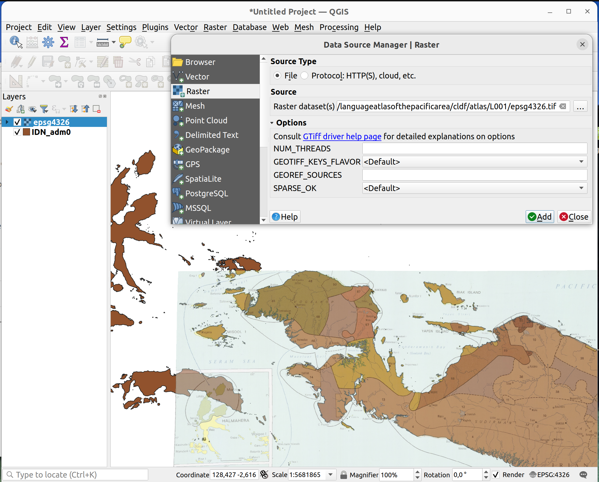
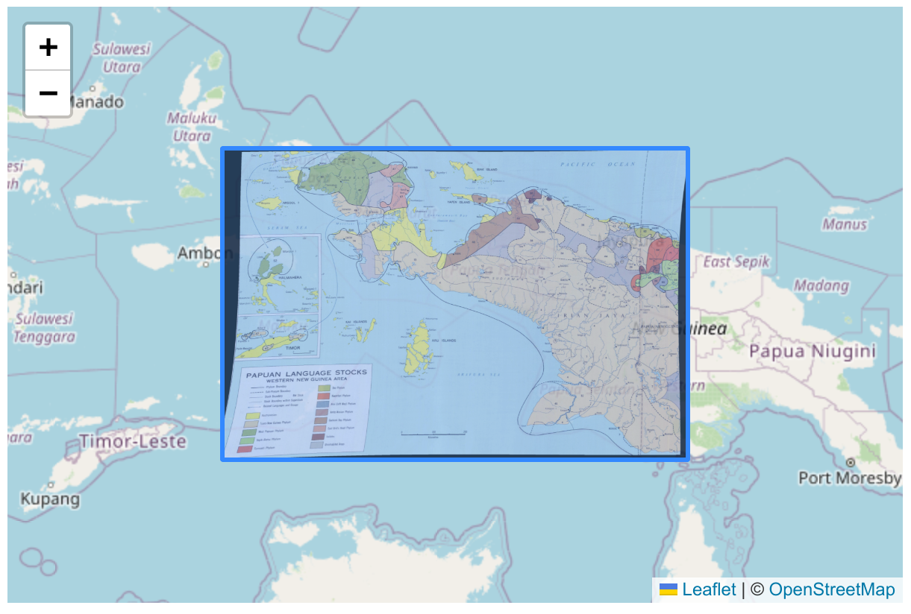
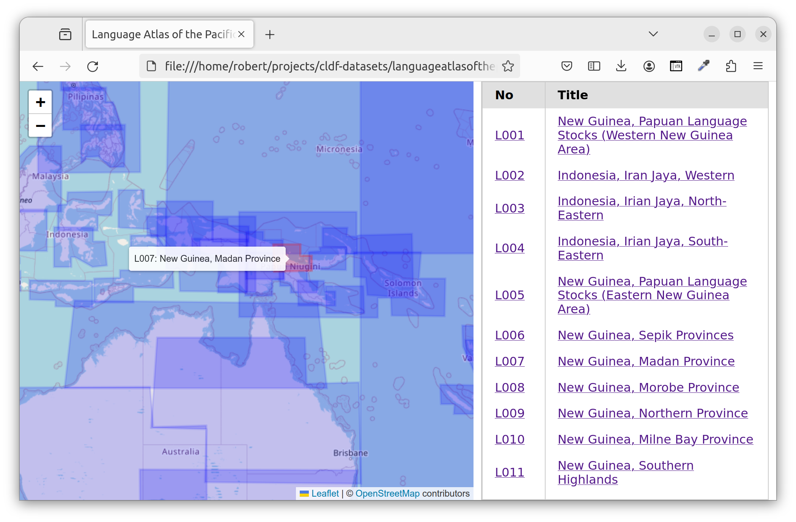
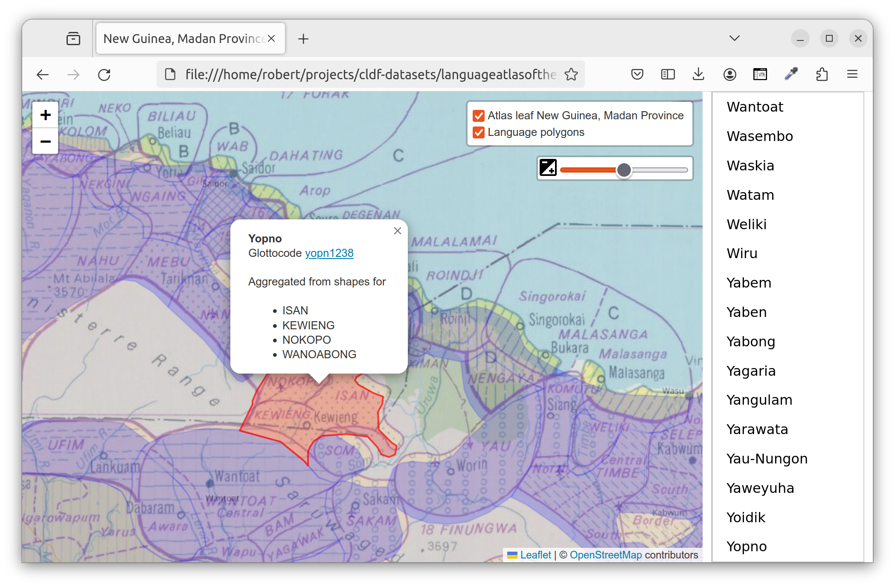

# Using the dataset

The data in this dataset can be used in various ways. First of all, it's a [CLDF](https://cldf.clld.org)
dataset, so many of the recipes from the [CLDF cookbook](https://github.com/cldf/cookbook) apply.


## The GeoJSON data

Arguably the most important part of the dataset are the "language polygons", i.e. the geographic
features representing areas where particular languages are spoken. These are linked from the CLDF
data (via the [speakerArea](https://github.com/cldf/cldf/tree/master/components/languages#speaker-area) property and a language's
ID), with features represented as GeoJSON features.

The three sets of GeoJSON features
- [ECAI shapes](cldf/ecai.geojson), i.e. cleaned up and aggregated shapes from ECAI's 
  [geo-registered - GIS dataset](https://ecaidata.org/dataset/pacific-language-atlas-gis)
- [language level areas](cldf/languages.geojson), i.e. aggregated areas for Glottolog languages
- [family level areas](cldf/families.geojson), i.e. aggregated areas for Glottolog top-level families
  and isolates.

can be used with GeoJSON-aware software like QGIS or https://geojson.io right away.


### Programmatic usage with `pycldf` and `shapely`

But the data can also be accessed programmatically, e.g. using the `pycldf` package.

In the following we'll show how this can be done, roughly following the example given in
[this blogpost](https://hedvigsr.tumblr.com/post/730257310587453440/dont-use-statsdist-for-geographic-distances-it),
i.e. we will investigate the data for three languages spoken in the Pacific around the antimeridian:
- [Akei](https://glottolog.org/resource/languoid/id/akei1237), spoken on Espiritu Santo in Vanuatu,
- [Western Viti Levu-Yasawas Fijian](https://glottolog.org/resource/languoid/id/west2519), spoken on Viti Levu in Fiji 
  (there is no data on [Fijian](https://glottolog.org/resource/languoid/id/fiji1243) in the dataset, because the
  area labeled "EASTERN FIJIAN" in the Language Atlas covers the speaker areas of multiple languages of the
  [Eastern Fijian](https://glottolog.org/resource/languoid/id/east2446) group),
- [Samoan](https://glottolog.org/resource/languoid/id/samo1305) spoken in Samoa.

We start by using `pycldf` to retrieve language objects corresponding to these three languages:
```python
>>> from pycldf import Dataset
>>> ds = Dataset.from_metadata('cldf/Generic-metadata.json')
>>> lgs = {lg.cldf.name: lg for lg in ds.objects('LanguageTable')
...     if lg.cldf.name in ['Akei', 'Western Viti Levu-Yasawas Fijian', 'Samoan']}
```

We can now create GeoJSON data to draw a map as the one in the blogpost, with markers for the three
languages and lines connecting these markers. For the point markers, we can (roughly) compute
[centroids](https://en.wikipedia.org/wiki/Geographical_centre) of the speaker areas using 
[`shapely`](https://pypi.org/project/shapely/). To make sure we do not run into 
[problems with the antimeridian](https://antimeridian.readthedocs.io/en/stable/), we translate the 
speaker areas to pacific centered geometries using [cldfgeojson](https://pypi.org/project/cldfgeojson/)
functionality:
```python
>>> from shapely.geometry import shape
>>> from cldfgeojson import pacific_centered, feature_collection
>>> geojson = feature_collection([])
>>> centroids = {}
>>> for lname, lg in lgs.items():
...     feature = pacific_centered(lg.speaker_area_as_geojson_feature)
...     centroids[lname] = centroid = shape(feature['geometry']).centroid
...     geojson['features'].append(feature)
...     geojson['features'].append({"type": "Feature", "geometry": {"type": "Point", "coordinates": [centroid.x, centroid.y]}})
...     
>>> for start, end in [('Akei', 'Western Viti Levu-Yasawas Fijian'), ('Western Viti Levu-Yasawas Fijian', 'Samoan')]:
...     geojson['features'].append({"type": "Feature", "geometry": {"type": "LineString", "coordinates": [[centroids[start].x, centroids[start].y], [centroids[end].x, centroids[end].y]]}})
...     
```

A quick way to visualize this GeoJSON is using GitHub flavored markdown's [support for GeoJSON](https://docs.github.com/en/get-started/writing-on-github/working-with-advanced-formatting/creating-diagrams#creating-geojson-and-topojson-maps).
We do this by including the result of
```python
>>> import json
>>> print(json.dumps(geojson))
```
as GeoJSON snippet in the markdown below (view raw to see the markup and the GeoJSON data):
```geojson
{"type": "FeatureCollection", "features": [{"type": "Feature", "properties": {"title": "Akei", "fill": "#CC5151", "family": "Austronesian", "cldf:languageReference": "akei1237", "fill-opacity": 0.5}, "geometry": {"type": "Polygon", "coordinates": [[[166.64193338852056, -15.416924277293104], [166.64191594264406, -15.41686367511942], [166.64197198799678, -15.416840536561892], [166.64199384093564, -15.416833278401372], [166.67203924324966, -15.407728611033487], [166.72082326159554, -15.3929455751711], [166.76172302370227, -15.38055170786603], [166.7621701720841, -15.380392673577191], [166.76260022807188, -15.380191961276218], [166.76300931714366, -15.379951379249116], [166.76339375367553, -15.37967309498194], [166.76375007414686, -15.379359615633161], [166.7640750683442, -15.379013765445826], [166.76436580828332, -15.378638660302975], [166.76461967458832, -15.37823767965558], [166.76859499968035, -15.371245028366948], [166.76859784953749, -15.371240293801407], [166.768640680433, -15.371179566806445], [166.76869312077255, -15.371210975173526], [166.76871234375847, -15.371224472817445], [166.83102948501295, -15.417547750293961], [166.83103354584983, -15.417550910080365], [166.83109087110938, -15.41760172097008], [166.83112821288444, -15.41764137367468], [166.831142135776, -15.417658197704466], [166.86474998909873, -15.460314319229443], [166.86481735999132, -15.460405794429182], [166.86487864588653, -15.460501453137084], [166.9010959082561, -15.521294714971685], [166.90109895361567, -15.521300153820087], [166.90116876197428, -15.521451398358588], [166.9011757278643, -15.52147037805465], [166.91835650983325, -15.572889272150778], [166.91835816405992, -15.572894668202178], [166.9183753552558, -15.572969864439651], [166.91832664107758, -15.573010321699538], [166.91830710738188, -15.573024274440497], [166.84944209071452, -15.619437923716859], [166.84906161420446, -15.619721512894799], [166.84870973562843, -15.62003989421379], [166.84838962450027, -15.620390199883436], [166.84810416419148, -15.620769274557698], [166.84785592595952, -15.621173703756373], [166.84764714578736, -15.621599844620718], [166.84747970424317, -15.622043858726162], [166.83991978802914, -15.645391316154631], [166.83991792561378, -15.645396618866684], [166.8398870095455, -15.6454678843747], [166.83982784896196, -15.645490935339902], [166.83980501338908, -15.645497996298024], [166.813949357226, -15.652739606204394], [166.81394351329342, -15.652741079377842], [166.81385904688972, -15.65275566387882], [166.81379195049018, -15.65274585482926], [166.81376689026274, -15.65274021833699], [166.79327304012327, -15.647513246505774], [166.793266387034, -15.647511335273117], [166.79309277048839, -15.647444609265154], [166.793072554246, -15.647434666421297], [166.7721516314498, -15.636280740326505], [166.772146232204, -15.636277671768248], [166.77207303168902, -15.636228100797231], [166.77203076187695, -15.636172388266614], [166.77201645326585, -15.636150089010709], [166.64516708504598, -15.425046590564198], [166.6451646999612, -15.425042431079902], [166.64510818767653, -15.424928733648896], [166.64510216786798, -15.42491449100615], [166.6419386898315, -15.41693865398237], [166.64193338852056, -15.416924277293104]]]}}, {"type": "Feature", "geometry": {"type": "Point", "coordinates": [166.78726225882488, -15.507664584936174]}}, {"type": "Feature", "properties": {"title": "Samoan", "fill": "#CC5151", "family": "Austronesian", "cldf:languageReference": "samo1305", "fill-opacity": 0.5}, "geometry": {"type": "MultiPolygon", "coordinates": [[[[191.77741209014036, -14.616373298300587], [191.77740648725154, -14.616315585244738], [191.77740589559892, -14.616293063794163], [191.77740589559892, -14.457278597817705], [191.77740603197654, -14.457273111728536], [191.7774131587848, -14.457200003975233], [191.7774731542283, -14.457207192795478], [191.77749604779135, -14.457211635425658], [191.90765334478837, -14.486135479202773], [192.04084616003504, -14.51573388259092], [192.04085098142792, -14.515735079172112], [192.04091004931743, -14.51575432838815], [192.04086468231014, -14.515776984523928], [192.04084522293593, -14.515785013455496], [191.77748501232506, -14.616352716586846], [191.77748001026532, -14.616354489264168], [191.77741209014036, -14.616373298300587]]], [[[190.3222530155225, -14.164611197187446], [190.3223129339139, -14.164609808978433], [190.32233617497735, -14.164610963830443], [190.51029319501185, -14.179069196140786], [190.5102986535357, -14.179069751074387], [190.5103717155113, -14.179082496631192], [190.5103730211001, -14.17914348793308], [190.51037185369455, -14.179166774800668], [190.50261581269606, -14.279995307780942], [190.50261525776273, -14.280000766302214], [190.50260251220578, -14.280073828278928], [190.50254152090417, -14.280075133867749], [190.50251823403622, -14.280073966462167], [190.34892743424533, -14.2682592895552], [190.34892203930974, -14.268258744593803], [190.3488489276718, -14.268246182042827], [190.3488282204516, -14.26818888900002], [190.34882191553115, -14.26816673183836], [190.32226538773227, -14.164688553839085], [190.32226415938692, -14.164683217233952], [190.3222530155225, -14.164611197187446]]], [[[189.16580919637028, -14.321432671819622], [189.16584519185855, -14.321383402220162], [189.16586035217148, -14.321365524118077], [189.17979639745573, -14.305802850312581], [189.17980021005914, -14.305798791828709], [189.17990886284463, -14.305698114448635], [189.17992291523535, -14.305686851815203], [189.19130096839086, -14.29704405249774], [189.19130580102262, -14.297040573479071], [189.1913817562055, -14.29699406700405], [189.1914389298276, -14.296966847339942], [189.191462585489, -14.296957681060887], [189.30727492746544, -14.255769717181426], [189.30728027797736, -14.25576795860797], [189.30742559579647, -14.255731252764466], [189.3074435373597, -14.2557280827141], [189.32487514822176, -14.253119372784047], [189.3249940380257, -14.25310572348709], [189.32511358320698, -14.253100242753238], [189.4210202344738, -14.251990670247908], [189.42102595959545, -14.251990748922264], [189.42110419124901, -14.251997598710961], [189.42113328089087, -14.252055046080136], [189.42114265692396, -14.252077533183888], [189.42712117598873, -14.267606962913627], [189.42712299333613, -14.267612043279913], [189.42714281641796, -14.267682607345947], [189.427092954783, -14.267716482713189], [189.4270731453324, -14.26772800946215], [189.41049619347015, -14.276804155052186], [189.4104905774804, -14.276807033591792], [189.41040323285782, -14.276843383359264], [189.41033863942437, -14.276862141602823], [189.41031225581364, -14.276867578646774], [189.35303054501532, -14.286905662006944], [189.3525375441819, -14.287018012642], [189.35205841155974, -14.2871795812569], [189.35159804718998, -14.287388715505662], [189.35116115917276, -14.287643276593347], [189.35075221551793, -14.287940661149294], [189.24519541162252, -14.373184426687759], [189.24519100468888, -14.37318781193184], [189.24512693924123, -14.37323018547162], [189.24506535566616, -14.373217967111604], [189.24504256447722, -14.37321174207758], [189.23967530456295, -14.371591926758152], [189.2396706676219, -14.371590421316382], [189.23960320737413, -14.371563912198706], [189.23955701861473, -14.371541045797553], [189.23953908525556, -14.371530771272262], [189.22262848693947, -14.361325316105695], [189.22258582003818, -14.36129855062904], [189.22252133915103, -14.361255196330877], [189.16586992205248, -14.321484257251125], [189.16586548825688, -14.321480977239638], [189.16580919637028, -14.321432671819622]]], [[[187.93580439626868, -13.870433073250515], [187.93582408197588, -13.870374406775182], [187.93583298207622, -13.87035292242051], [187.94076351159, -13.859269565584727], [187.94076620003955, -13.859263937067563], [187.94081129290572, -13.859185935968368], [187.94085823806878, -13.859134831719217], [187.94087772828942, -13.859116706794401], [187.9711684958507, -13.83256861117792], [187.97117252516358, -13.83256523767245], [187.97123265602255, -13.832521270368808], [187.97128786286382, -13.832500619547295], [187.97130923034595, -13.832494192722459], [188.09375530770197, -13.798932372023561], [188.09376146818394, -13.798930863299567], [188.09392891427026, -13.798903716148523], [188.09394943294524, -13.798902100783435], [188.11657406200368, -13.797798506511256], [188.11663257427662, -13.797796829096038], [188.11672287059352, -13.797797565486839], [188.1782071690452, -13.799739875781368], [188.17821266145015, -13.799740179215219], [188.17829408549764, -13.799750309946706], [188.178351014276, -13.799763067881544], [188.17837342711277, -13.79976973554953], [188.2524494905055, -13.82389930473881], [188.25247318113358, -13.823907246876418], [188.25250953440016, -13.823920072691491], [188.38133466577497, -13.870824045264905], [188.38133995359445, -13.870826117696934], [188.38147646486394, -13.870891099422535], [188.3814924353208, -13.87090018942852], [188.55630053009617, -13.976640143887977], [188.55630520721039, -13.976643127845966], [188.55636937379649, -13.97669063041203], [188.55641085348014, -13.976736035631347], [188.556425515953, -13.976754513728386], [188.56978913577433, -13.994526955179584], [188.56979271185125, -13.994531986481778], [188.56983787925122, -13.994607340886448], [188.56985274816066, -13.994675229253096], [188.5698563587336, -13.994701309767834], [188.57134650393274, -14.008402367015604], [188.57134699313636, -14.008408263332981], [188.57134771984718, -14.008493565588882], [188.57133477180943, -14.00855798473601], [188.57132798351876, -14.008582255463127], [188.55859470929337, -14.049660550258674], [188.5585929516663, -14.049665765025047], [188.55856411684385, -14.049734662497384], [188.5585030255497, -14.049728399862422], [188.5584799889278, -14.049724361670814], [188.53540754780505, -14.045042969414832], [188.535160151225, -14.044999213296265], [188.52077672406426, -14.042826405640367], [188.52037131617803, -14.042781984982566], [188.48041645378873, -14.040047203126662], [188.48000205819835, -14.040036064067365], [188.47958816413225, -14.040059290905521], [188.45448311075074, -14.042515464411728], [188.45444993551877, -14.042518328108608], [188.45439867214478, -14.042521673810247], [188.4117051342757, -14.044737371049086], [188.411640153573, -14.044739291672762], [188.4115398792723, -14.044738154208966], [188.352251269514, -14.042522059805462], [188.35219108339453, -14.042518562553727], [188.35209851116178, -14.042509651977461], [188.23249461083338, -14.028077458167122], [188.2324645388877, -14.028073511769408], [188.2324182685963, -14.028066539827565], [188.08950210355178, -14.004755379559475], [188.08949684831958, -14.004754397698445], [188.08942342562972, -14.00473552552351], [188.08937166986107, -14.00470520208492], [188.08935288838046, -14.004692436504275], [187.95004427345157, -13.904805378000448], [187.95003867481802, -13.904801098456787], [187.9498988901647, -13.904673072595639], [187.94988345938714, -13.904656083748582], [187.94210517568362, -13.895496328808173], [187.94210182031537, -13.895492188647161], [187.94205825995886, -13.895430446126303], [187.9420384924435, -13.895374018916788], [187.94203245057415, -13.895352205281085], [187.93581723706052, -13.870514089812644], [187.93581603502471, -13.870508751762175], [187.93580439626868, -13.870433073250515]]], [[[187.20199224340647, -13.517031067910542], [187.202014311868, -13.516973585098954], [187.20202407106885, -13.516952613609122], [187.20943752073592, -13.502040784225322], [187.20944023330415, -13.502035656847747], [187.20948338577475, -13.501966821102322], [187.20954088086356, -13.501935135095136], [187.20956332374232, -13.501924835911408], [187.2263502077542, -13.494773222915114], [187.22635552022444, -13.494771112392309], [187.22643690894662, -13.494745333339978], [187.22649632595346, -13.494732911600492], [187.22652043105282, -13.494729647986349], [187.24302750133316, -13.492943773273952], [187.24303279260238, -13.492943323168989], [187.24310747733998, -13.492941956656548], [187.24316373599066, -13.492962517588362], [187.24318435575395, -13.49297165304838], [187.25254777146148, -13.497402927792578], [187.25296575137597, -13.497578018434867], [187.25339786742697, -13.49771454557641], [187.2538405699723, -13.49781138770713], [187.25429022240635, -13.497867749311764], [187.32611737917915, -13.503580084809057], [187.32653163184776, -13.503595790417156], [187.3269457617474, -13.503577125856603], [187.32735692211696, -13.503524219429032], [187.38529223952827, -13.493612647732752], [187.38573830379693, -13.493515184962016], [187.43004244731415, -13.481691895977159], [187.43006810173296, -13.481685298689516], [187.43010784559124, -13.481675780809866], [187.50669771452593, -13.46418999664027], [187.50672744961787, -13.464183533670592], [187.5067735070582, -13.464174442002754], [187.5908457714488, -13.448639515338488], [187.590891741195, -13.44863177889947], [187.59096297837928, -13.448621927418523], [187.62109366874304, -13.445026443071937], [187.6210990604536, -13.445025926118786], [187.6212429483505, -13.445021860848291], [187.62126044008906, -13.445022585371303], [187.63358239830106, -13.445845430074645], [187.63358731501017, -13.445845862543415], [187.63371666718976, -13.445865265808301], [187.6337322348422, -13.445868618851867], [187.67850364430473, -13.456593043694902], [187.67850950924847, -13.45659461253368], [187.67859216999054, -13.456623638760323], [187.67864968685737, -13.456658927683234], [187.6786706493219, -13.456674107660461], [187.6941403409015, -13.468566244223272], [187.694145370789, -13.468570339987386], [187.6942706869894, -13.468690585267947], [187.694284606529, -13.468706394806421], [187.75945513654705, -13.547449041805642], [187.75949977322006, -13.547505778634415], [187.75956458089104, -13.547596330691697], [187.7789094856773, -13.57634606310904], [187.7789121233336, -13.576350164722285], [187.7789753133792, -13.576462844990731], [187.7789821360777, -13.576477018916048], [187.78862875262965, -13.597738252802387], [187.78864951201834, -13.597786279067503], [187.78867908229668, -13.597861381061849], [187.8136332167984, -13.665350972100564], [187.81363511063356, -13.665356520794893], [187.81365726620592, -13.6654413153807], [187.81366671393525, -13.665502907876236], [187.8136686781756, -13.665527797736118], [187.81419321016466, -13.675758044851387], [187.81419336168486, -13.67576411488324], [187.81418886201837, -13.675851619764394], [187.81417124973265, -13.67591676966025], [187.81416260596995, -13.675941168817893], [187.76968964256415, -13.790906788269675], [187.7696874164021, -13.790912134704357], [187.76965127271902, -13.790983551801116], [187.7695885157384, -13.791001992912875], [187.7695644143007, -13.791007173779779], [187.75706925781225, -13.793333099795786], [187.75706315692466, -13.793334067861547], [187.756970929202, -13.793341449005643], [187.75690517614558, -13.793339517633601], [187.75687897806395, -13.793336704182634], [187.72364160044856, -13.788786078268807], [187.7234299780231, -13.788761684672107], [187.58931221462635, -13.776190556620133], [187.58888722554946, -13.776168909343692], [187.58846193496203, -13.776183477676184], [187.58803942340236, -13.776234156093741], [187.49609420016034, -13.791255510088487], [187.4960893249452, -13.791256201787478], [187.49595925939377, -13.791266619994028], [187.495943375227, -13.791266887381267], [187.47319008746092, -13.791128655856058], [187.47318429025597, -13.791128476258294], [187.47303059238558, -13.791112543788547], [187.47301211364456, -13.791109217782802], [187.45417018963494, -13.78718696734942], [187.45416493156893, -13.787185744576828], [187.4540916969187, -13.787163406017001], [187.4540409332445, -13.787130341176558], [187.45402260472653, -13.78711655200401], [187.40764378887306, -13.750346732939047], [187.40763973286911, -13.75034336501449], [187.4075847500092, -13.750291238358805], [187.4075504182746, -13.750244037231424], [187.40753846982594, -13.75022510517337], [187.3922298779217, -13.724588456402218], [187.39196920092346, -13.724195313226797], [187.3916726350753, -13.723828485267807], [187.29113554161353, -13.610821012969144], [187.29065910982143, -13.61035263980284], [187.2304128811259, -13.558568343631851], [187.2303233463814, -13.558485788592513], [187.23023977898356, -13.55839719799209], [187.20925041010508, -13.534532209803372], [187.20924635028666, -13.534527329875763], [187.20919149803686, -13.534449535762386], [187.20915895171288, -13.534390200786282], [187.20914785573504, -13.534365473991418], [187.20201646827954, -13.517108309564861], [187.20201450910696, -13.517103230801066], [187.20199224340647, -13.517031067910542]]]]}}, {"type": "Feature", "geometry": {"type": "Point", "coordinates": [188.3326533995618, -13.85462506887418]}}, {"type": "Feature", "properties": {"title": "Western Viti Levu-Yasawas Fijian", "fill": "#CC5151", "family": "Austronesian", "cldf:languageReference": "west2519", "fill-opacity": 0.5}, "geometry": {"type": "Polygon", "coordinates": [[[177.25166839659624, -17.92274691772458], [177.25165709536608, -17.922682283013458], [177.25165799328525, -17.922619134406826], [177.251659896782, -17.922596071313578], [177.2611168154847, -17.835271858638837], [177.26111757283968, -17.835266189571772], [177.26113381866327, -17.835188161359667], [177.26118052637662, -17.835143336340792], [177.26119926101597, -17.83512780251281], [177.2838882510392, -17.817332404776668], [177.28389367520487, -17.817328400481976], [177.28404777639955, -17.817233674565827], [177.28406738568955, -17.81722387361284], [177.3735691275274, -17.775994642586582], [177.37398137500676, -17.77578100318184], [177.37437202709788, -17.775530043577117], [177.37473771497682, -17.775243927945432], [177.37507528510082, -17.774925123631032], [177.43315441283016, -17.714732727968343], [177.4334880440263, -17.714349810050717], [177.43378110950346, -17.71393502271635], [177.4340305855773, -17.71349264550712], [177.4342338982943, -17.713027242621692], [177.4343889499885, -17.712543615824675], [177.43449414092387, -17.712046754904723], [177.4345483857997, -17.71154178619271], [177.4345511249479, -17.71103391967114], [177.43450233010748, -17.710528395220486], [177.42588707778367, -17.652357787829114], [177.4257957665995, -17.651893853980397], [177.42566104000508, -17.65144061994251], [177.42548410284607, -17.651002138939376], [177.42526653745273, -17.650582332260107], [177.42501028948925, -17.650184954191307], [177.42471765055404, -17.649813558442894], [177.42439123768602, -17.64947146636765], [177.4240339699609, -17.649161737258726], [177.423649042386, -17.648887140990684], [177.3918920026864, -17.628426759691703], [177.3918872349553, -17.62842351481771], [177.3918245533869, -17.628373758858967], [177.39181217969937, -17.628309710013582], [177.391809305256, -17.628285332910522], [177.38973468148762, -17.605267609348566], [177.38973432287315, -17.605262212505977], [177.38973447748558, -17.60518717747948], [177.3897721474471, -17.605138970057368], [177.3897875027495, -17.605121874259577], [177.51771885055913, -17.469833178173424], [177.51772295062815, -17.469829054125377], [177.51778853711195, -17.469772039082873], [177.5178390717917, -17.469736484593092], [177.5178603036081, -17.469723749154383], [177.62765190783256, -17.40787742401907], [177.62775068180278, -17.40782586013496], [177.62785254044329, -17.407780694344183], [177.82720806083807, -17.326884459047484], [177.82721325277151, -17.326882500392177], [177.82728541953608, -17.326861061691854], [177.82731884882926, -17.326913152638962], [177.8273301267714, -17.32693387154678], [177.8366786453857, -17.34526627487698], [177.8369069421159, -17.345667121676346], [177.8371712099708, -17.3460452222641], [177.83746919952821, -17.34639735828504], [177.83779837433025, -17.346720532391817], [177.83815593247317, -17.347011993758063], [177.83853883045708, -17.347269261493143], [177.83894380909177, -17.347490145759274], [177.83936742123876, -17.347672766411204], [177.90077227268884, -17.370847620544545], [177.90077732131755, -17.370849665802847], [177.90084426253804, -17.37088239561518], [177.9008477379716, -17.370943486772838], [177.9008474343191, -17.370966629677625], [177.86722394177636, -18.226904959295183], [177.86722359767796, -18.22691034626827], [177.86721389917918, -18.22698165935019], [177.86715630781674, -18.22696790681659], [177.8671344446186, -18.22696100261884], [177.6168644607589, -18.140533957312687], [177.61644200373274, -18.140408611432107], [177.52032003025573, -18.116442058959272], [177.51986284015723, -18.11635047226054], [177.51939910642167, -18.11630187254772], [177.51893286188005, -18.11629668246513], [177.5184681611983, -18.116334947147994], [177.5180090456164, -18.116416333829925], [177.47619791364664, -18.125857915632796], [177.4761919171831, -18.12585910341222], [177.47610554778356, -18.125869379543303], [177.47603814847503, -18.12585553649545], [177.4760130963639, -18.12584833779719], [177.3346611840928, -18.080766221841724], [177.334655993116, -18.080764429435963], [177.33458484382274, -18.080734225870128], [177.33454093655828, -18.080690485021936], [177.33452557614035, -18.080672908497085], [177.3022824596152, -18.041792285723567], [177.30227835910853, -18.041787040882895], [177.30218055199438, -18.041637728472338], [177.30217030334722, -18.04161867174885], [177.2622781897116, -17.96151089202923], [177.26227577765994, -17.96150573672825], [177.26222144841805, -17.961364285175517], [177.26221612255208, -17.96134665539175], [177.25167210785912, -17.92276186675403], [177.25166839659624, -17.92274691772458]]]}}, {"type": "Feature", "geometry": {"type": "Point", "coordinates": [177.63344238964277, -17.795599827068596]}}, {"type": "Feature", "geometry": {"type": "LineString", "coordinates": [[166.78726225882488, -15.507664584936174], [177.63344238964277, -17.795599827068596]]}}, {"type": "Feature", "geometry": {"type": "LineString", "coordinates": [[177.63344238964277, -17.795599827068596], [188.3326533995618, -13.85462506887418]]}}], "properties": {}}
```

Let's compute the lengths of the two LineStrings. Since we adjusted the geometries to be pacific-centered,
we'd expect roughly equal results for both distances.
```python
>>> centroids['Akei'].distance(centroids['Western Viti Levu-Yasawas Fijian'])
11.08486676069407
>>> centroids['Western Viti Levu-Yasawas Fijian'].distance(centroids['Samoan'])
11.401947126675251
```

These distances are in [decimal degrees](https://en.wikipedia.org/wiki/Decimal_degrees)
and computed in the [cartesian plane](https://en.wikipedia.org/wiki/Cartesian_coordinate_system). Thus,
these computations only work near the equator, where WSG 84 coordinates are 
[close enough to a cartesian plane](https://en.wikipedia.org/wiki/Longitude#Length_of_a_degree_of_longitude)
with roughly 110km units.


### Geographically informed usage with `spatialite`

While much of the data in this dataset meets the requirement of "being close to the equator", we can also compute
"proper" distances, i.e. [geodesic](https://en.wikipedia.org/wiki/Geodesic) (aka "Great Circle") distances.
This can be done for example using [spatialite](https://www.gaia-gis.it/fossil/libspatialite/index), a
library that extends the [SQLite](https://sqlite.org) database system, adding spatial capabilities.
On Ubuntu, [mod_spatialite](https://www.gaia-gis.it/fossil/libspatialite/wiki?name=mod_spatialite) - the SQLite extension
module - can be installed running
```shell
sudo apt install libsqlite3-mod-spatialite
```

To load GeoJSON data from this dataset into a spatialite database we use the [geojson-to-sqlite](https://pypi.org/project/geojson-to-sqlite/)
tool:
```shell
pip install geojson-to-sqlite
geojson-to-sqlite laotpa_languages.sqlite features cldf/languages.geojson --spatialite
```

We can now investigate the data, e.g. using [SQLite's command-line program `sqlite3`](https://sqlite.com/cli.html).
First, we need to load the extension module:
```shell
$ sqlite3 laotpa_languages.sqlite 
SQLite version 3.37.2 2022-01-06 13:25:41
Enter ".help" for usage hints.
sqlite> SELECT load_extension('mod_spatialite');
```

We loaded the features of our GeoJSON into a table `features` (by passing "features" as TABLE argument to `geojson-to-sqlite`).
Let's see what the table looks like:
```sql
sqlite> pragma table_info(features);
0|title|TEXT|0||0
1|fill|TEXT|0||0
2|family|TEXT|0||0
3|cldf:languageReference|TEXT|0||0
4|fill-opacity|FLOAT|0||0
5|geometry|GEOMETRY|0||0
```

So each field from the [`properties` member](https://datatracker.ietf.org/doc/html/rfc7946#section-3.2)
of features in our GeoJSON is available as column, in particular the `title` field which holds the
Glottolog name of the corresponding languages. The additional `geometry` column is the one `spatialite`
operates on.

Thus, to compute geodesic distances for the two lines of interest, we'll use spatialite's
- `Centroid` function to compute the centroids of the respective speaker areas,
- `makeline` function to create the proper input for
- `GeodesicLength`, which computes the distance between the end points of a line.

```sql
sqlite> select GeodesicLength(makeline(Centroid(l1.geometry), Centroid(l2.geometry)))
   ...> from features as l1, features as l2 where l1.title = 'Samoan' and l2.title = 'Western Viti Levu-Yasawas Fijian';
1225957.11115731
sqlite> select GeodesicLength(makeline(Centroid(l1.geometry), Centroid(l2.geometry)))
   ...> from features as l1, features as l2 where l1.title = 'Akei' and l2.title = 'Western Viti Levu-Yasawas Fijian';
1184221.69034282
```

`spatialite` returns geodesic lengths in meters and comparing these results to the ones above (multiplied by 110,000
assuming 110km for one degree)
we find errors of about 2.5%.


### Relating aggregated shapes to the ECAI shapes

In order to provide a useful dataset for language comparison, speaker areas are aggregated on
[Glottolog language level](https://glottolog.org/glottolog/glottologinformation#principles). It's still
possible to drill down and investigate which ECAI shapes contributed to such a language-level
aggregation anmd to which Glottocodes these were linked. The relevant information is available from
the dataset's `ContributionTable`, more specifically from the `Properties` column of this table.
This column has datatype JSON, and its values are JSON objects with an optional, array-valued member `Glottocodes`.

Again, this data could be easily accessed using `pycldf`, which will read typed data, i.e. provide
```python
>>> ds = Dataset.from_metadata('cldf/Generic-metadata.json')
>>> ds.objects('ContributionTable')[100].data['Properties']
OrderedDict([('COUNTRY_NAME', 'Philippines'), ('SOVEREIGN', 'Philippines'), ('Glottocodes', ['isna1241'])])
```

But we could also exploit the fact that [each CLDF dataset can be converted to a SQLite database](https://github.com/cldf/pycldf?tab=readme-ov-file#converting-a-cldf-dataset-to-an-sqlite-database)
and use [SQLite's excellent JSON support](https://www.sqlite.org/json1.html).
First, load the tabular data of the CLDF dataset into an SQLite database:
```shell
cldf createdb cldf laotpa.sqlite 
```

Now we can verify that the speaker area for the language [Yopno](https://glottolog.org/resource/languoid/id/yopn1238)
was pieced together from shapes for its four dialects (shown below in the tree generated from Glottolog data)
```
Nuclear Trans New Guinea [nucl1709]
   └─ Finisterre-Huon [fini1244]
      └─ Finisterre-Saruwaged [fini1245]
         └─ Yupna [yupn1242]
            └─ Kewieng-Bonkiman-Nokopo [kewi1241]
               └─ Yopno [yopn1238]
                  ├─ Isan [isan1244]
                  ├─ Kewieng [kewi1240]
                  ├─ Nokopo [noko1240]
                  └─ Wandabong [wand1268]
```
using the following SQL:
```sql
SELECT
    l.cldf_id AS Language_Glottocode,
    l.cldf_name AS Language_Name, 
    gcs.gc AS Dialect_Glottocode, 
    c.cldf_name AS Dialect_Name
FROM
    LanguageTable AS l,
    LanguageTable_ContributionTable AS lc,
    ContributionTable as c,
    (
        SELECT c1.cldf_id, c2.value AS gc
        FROM
            ContributionTable AS c1
            JOIN
            json_each((
                SELECT json_extract(properties, '$.Glottocodes') 
                FROM ContributionTable
                WHERE cldf_id = c1.cldf_id AND json_extract(Properties, '$.Glottocodes') IS NOT NULL
            )) AS c2
    ) as gcs
WHERE
    l.cldf_id = lc.LanguageTable_cldf_id AND 
    lc.ContributionTable_cldf_id = c.cldf_id AND 
    lc.ContributionTable_cldf_id = gcs.cldf_id AND 
    l.cldf_glottocode = 'yopn1238' 
;
```
Let's break this down:

1. The outermost `SELECT` pulls together related rows from `LanguageTable` and `ContributionTable` for
   the language Yopno, specified by its Glottocode `yopn1238`. The many-to-many relation between `LanguageTable`
   and `ContributionTable` is mediated through the association table `LanguageTable_ContributionTable`.
2. Since the `Glottocodes` member in `ContributionTable.Properties` is array-valued, we need to create
   individual rows for each Glottocode using [json_each](https://www.sqlite.org/json1.html#jeach). These
   rows are then joined to each row of `ContributionTable`.

When stored in a file `query.sql` and run with `sqlite3` via
```shell
sqlite3 -header laotpa.sqlite < query.sql
```
this will compute the following result:

Language_Glottocode|Language_Name|Dialect_Glottocode|Dialect_Name
--- | --- | --- | ---
yopn1238|Yopno|kewi1240|KEWIENG
yopn1238|Yopno|noko1240|NOKOPO
yopn1238|Yopno|isan1244|ISAN
yopn1238|Yopno|wand1268|WANOABONG


## The geo-referenced Atlas leaves

Two variants of geo-referenced Atlas leaves are available in this dataset.


### EPSG:4326 GeoTIFF images

Geo-referenced images for the [EPSG:4326](https://en.wikipedia.org/wiki/EPSG_Geodetic_Parameter_Dataset)
coordinate reference system in GeoTIFF format can be found at `cldf/atlas/*/epsg4326.tif`
and can be used as raster layer with GIS tools such as QGIS.

Below is a screenshot of QGIS, viewing a vector layer of [Indonesia's administrative boundaries](https://data.humdata.org/dataset/geoboundaries-admin-boundaries-for-indonesia?)
and a raster layer of leaf L001.




### Web mercator projected JPEG images

Images re-projected to [web mercator projection](https://en.wikipedia.org/wiki/Web_Mercator_projection)
in JPEG format: The files can be found at `cldf/atlas/*/web.jpg` and can be used as image overlays
on web maps, e.g. using libraries such as [leaflet](https://leafletjs.com/examples/overlays/). Since
the JPEG images do not contain any geographic metadata, the geographic bounding boxes in WGS 84 coordinates
are provided in `cldf/atlas/*/bounds.geojson`.

Thus, plugging the `"bbox"` (lon, lat) coordinates from `cldf/atlas/L001/bounds.geojson`
```json
  "bbox": [
    128.69369434997662,
    -9.412595810623932,
    142.39506844201907,
    -0.25903341847583594
  ],
```
and `cldf/atlas/L001/web.jpg` into minimal HTML as below
```html
<!DOCTYPE html>
<html lang="en">
<head>
	<meta charset="utf-8">
    <link rel="stylesheet" href="https://unpkg.com/leaflet@1.9.4/dist/leaflet.css" integrity="sha256-p4NxAoJBhIIN+hmNHrzRCf9tD/miZyoHS5obTRR9BMY=" crossorigin=""/>
    <script src="https://unpkg.com/leaflet@1.9.4/dist/leaflet.js" integrity="sha256-20nQCchB9co0qIjJZRGuk2/Z9VM+kNiyxNV1lvTlZBo=" crossorigin=""></script>
</head>
<body>
<div id='map' style="width: 600px; height: 400px;"></div>
<script>
	const map = L.map('map').setView([180, -96], 3);
	const osm = L.tileLayer('https://tile.openstreetmap.org/{z}/{x}/{y}.png', {
		maxZoom: 19,
		attribution: '&copy; <a href="http://www.openstreetmap.org/copyright">OpenStreetMap</a>'
	}).addTo(map);

	const imageUrl = 'cldf/atlas/L001/web.jpg';
	const latLngBounds = L.latLngBounds([[-9.412595810623932, 128.69369434997662], [-0.25903341847583594, 142.39506844201907]]);
	const imageOverlay = L.imageOverlay(imageUrl, latLngBounds, {
		opacity: 0.8,
		interactive: true
	}).addTo(map);
	L.rectangle(latLngBounds).addTo(map);
	map.fitBounds(latLngBounds);
</script>
</body>
</html>
```
the resulting page - overlaying the Atlas leaf on OpenStreetMap base tiles - should display as follows in a browser:




## Errata

Most of the data in this dataset has been collected, transcribed and curated by multiple people. Thus,
there's no doubt it will (still) contain errors. But the dataset creation pipeline in this repository
has maintenance hatches built in, so we can fix errors and [recreate and release the dataset easily](RELEASING.md) - and
will do so periodically. Any errors should be reported at https://github.com/cldf-datasets/languageatlasofthepacificarea/issues
in particular:
- incorrect assignment of Glottolog languoids. (It should be noted, though, that "correctness" means fidelity
  to the source, not necessarily "reality". So if the source claims that a language, that can be clearly matched
  to a Glottolog language, is spoken in some location but this is factually not the case, the dataset would
  still be correct in relaying Wurm & Hattori's claim.)
- incorrect digitization of the source, e.g. mis-labeled polygons.

A good way of investigating fidelity of the digitization to the source (Wurm & Hattori's Atlas), is
browsing maps where the polygons are overlaid over geo-referenced scans. Such maps can be created running
a [cldfbench subcommand](https://github.com/cldf/cldfbench/blob/master/src/cldfbench/commands/README.md) provided with this repository.

After installing the commands via
```shell
pip install -e .
```
you can run
```shell
cldfbench laotpa.browser
```
to create a set of HTML pages in a subdirectory `language_atlas_of_the_pacific_area` that can be navigated pointing your browser to
`language_atlas_of_the_pacific_area/index.html`.

The index page provides a list of Atlas leaves with clickable titles leading to the individual pages,
and equally clickable polygons on a map, depicting the extent of the geo-referenced area on the corresponding
leaf.



Pages for individual leaves provide a list of languages on the right hand side, with clickable names
to highlight the speaker are on the map. Both, the polygon layer as well as the image overlay can be
toggled using the layer control on the map. Opacity of the image overlay can be controlled with the
corresponding range slider. Clicking on a polygon will open a popup window listing all language (variety) names
given in the ECAI data for shapes aggregated under the given Glottolog language.


