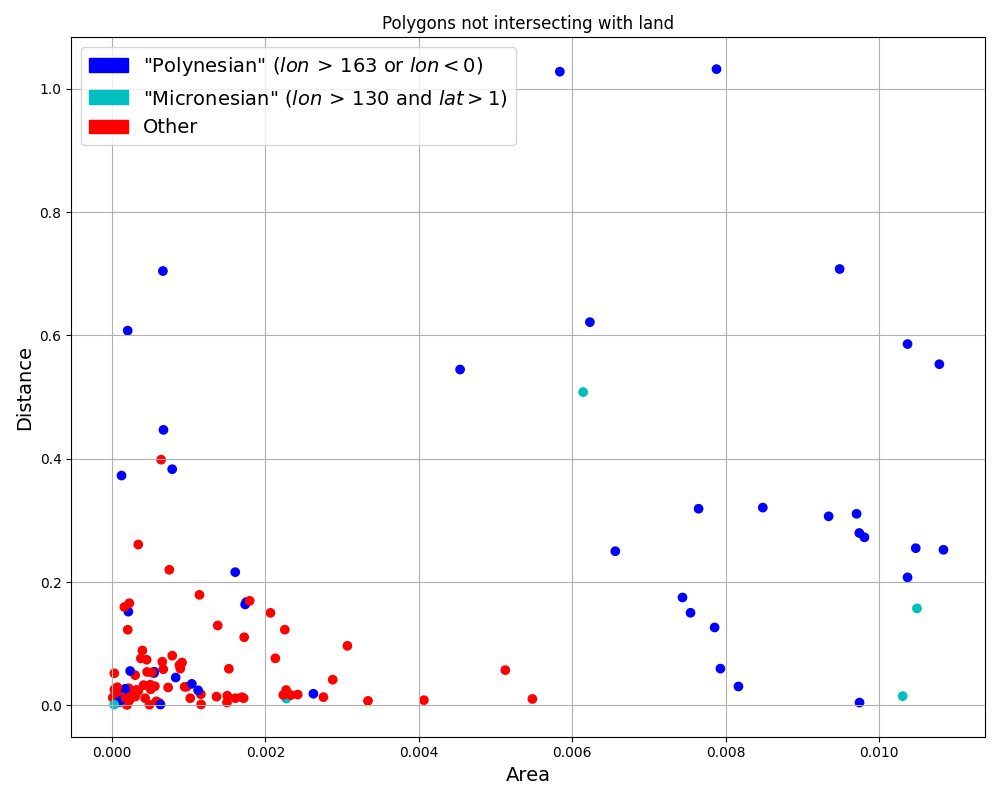
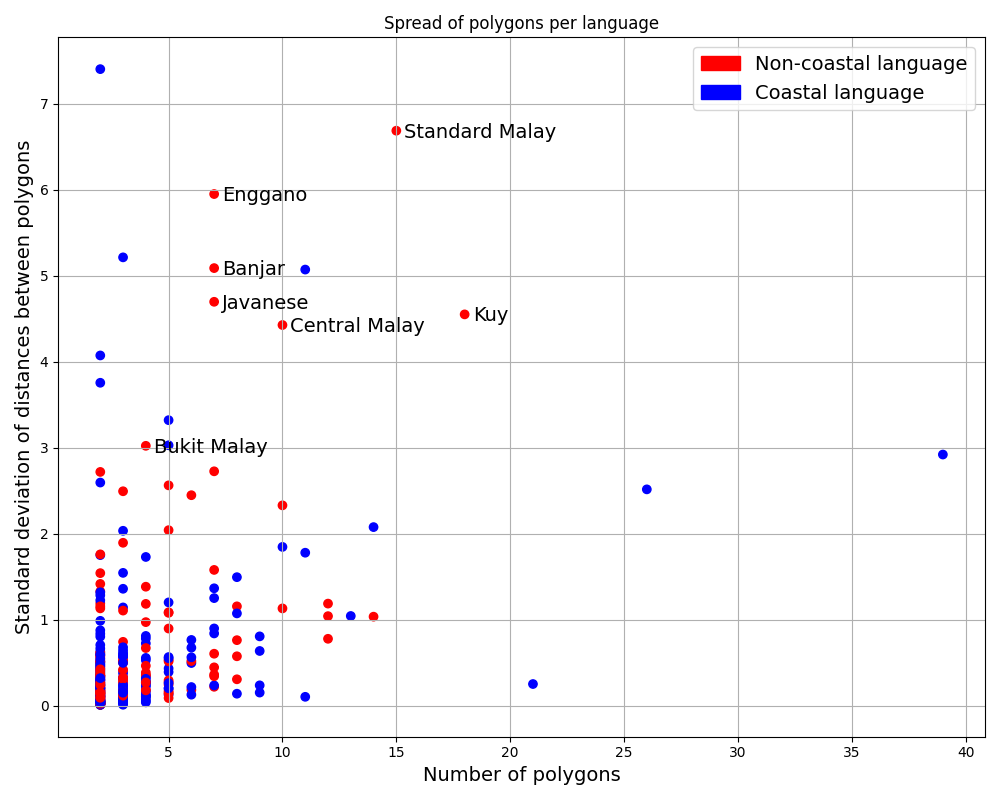

# Validating the CLDF dataset

Run CLDF validation:
```shell
cldf validate cldf
```

Make sure the dataset can be loaded into SQLite:
```shell
rm -f laotpa.sqlite
cldf createdb cldf laotpa.sqlite 
```

## Technical validation experiments described in the paper

The following three `cldfbench` sub-commands will re-create data tables as CSV files in [etc](etc/) and corresponding
figures - unless run with the `--plot-only` option, in which case the existing data will be used and
only the plot will be recreated.

Running these commands requires "installing" the dataset via `pip install -e .`, to install `cldfbench`
and register the subcommands.

1. [Polygons not intersecting with landmasses](laotpa_commands/landmass_distance.py):
   ```shell
   cldfbench laotpa.landmass_distance -h
   cldfbench laotpa.landmass_distance
   ```
   

2. [Distance between shapes and point coordinate of corresponding Glottolog language](laotpa_commands/glottolog_distance.py):
   ```shell
   cldfbench laotpa.glottolog_distance -h
   cldfbench laotpa.glottolog_distance
   ```
   

3. [Spread of polygons for MultiPolygon shapes](laotpa_commands/multipolygon_spread.py):
   ```shell
   cldfbench laotpa.multipolygon_spread -h
   cldfbench laotpa.multipolygon_spread
   ```
   
