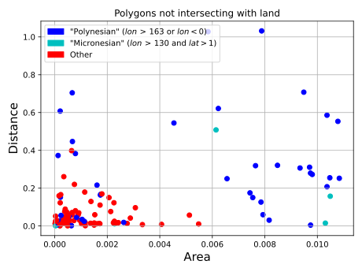
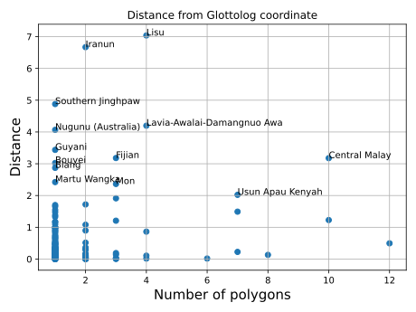
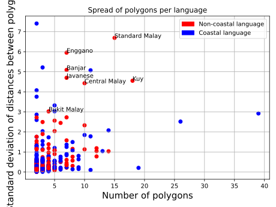

# Configuration directory

This directory contains "configuration" data, i.e. data which helps with and
guides the conversion of the raw data to CLDF. It also contains results of validating the
resulting CLDF dataset.


## Running the validation analyses

```shell
cldfbench laotpa.landmass_distance
```




```shell
cldfbench laotpa.glottolog_distance ../../glottolog/glottolog-cldf/cldf
```



```shell
cldfbench laotpa.multipolygon_spread
```

